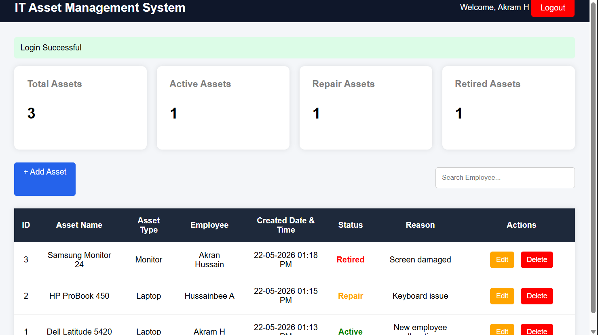

# IT Asset Pipeline System

A web-based IT Asset Management System developed using Flask and SQLite.  
This application helps organizations manage and track IT assets efficiently.

---

 Live Demo

🔗 [Live Demo](https://it-asset-pipeline-system.onrender.com/)

## Features

- User Authentication
- Asset Management
- Add and Manage Assets
- Employee Asset Tracking
- Asset Status Management
- Database Integration
- Responsive User Interface

---

## Technologies Used

- Python
- Flask
- SQLite
- HTML
- CSS
- Bootstrap

---

## Installation

```bash
git clone https://github.com/chussainbee2026-commits/IT_Asset_Pipeline_System.git
```

```bash
cd IT_Asset_Pipeline_System
```

```bash
pip install -r requirements.txt
```

```bash
python app.py
```

---

## Screenshots

### Login Page


---

### Register Page


---

### Asset Management Table


---

### Assets Record Table


---

## Author

Hussain Bee
