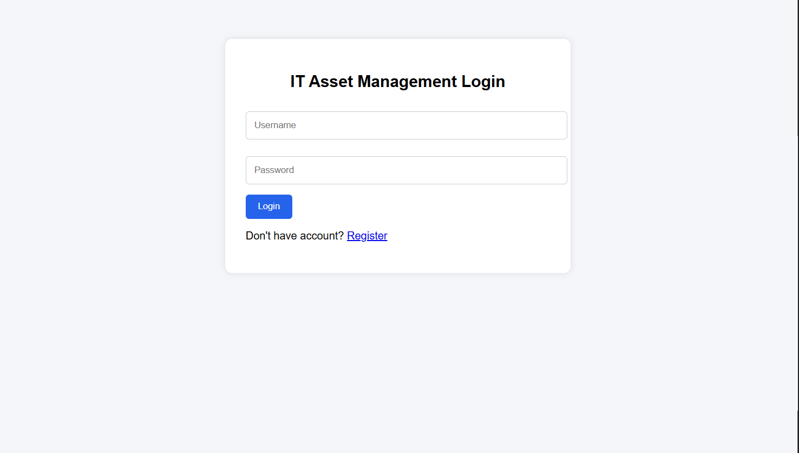
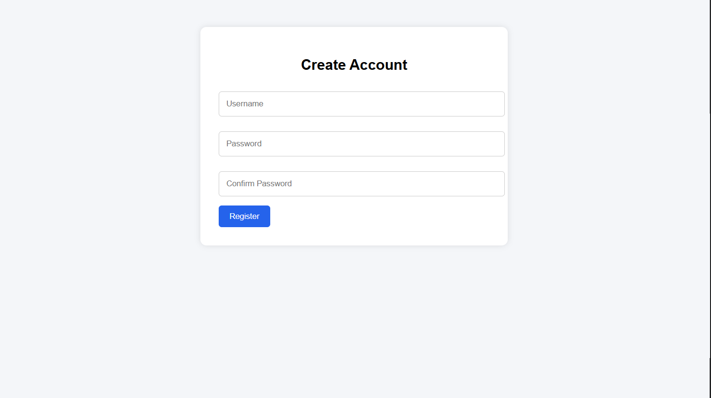
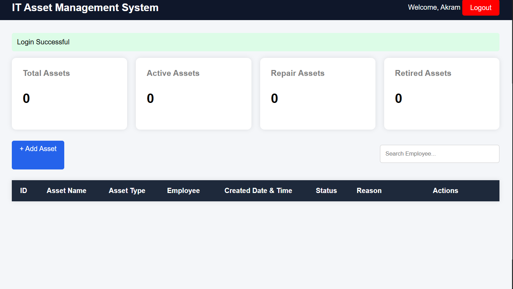
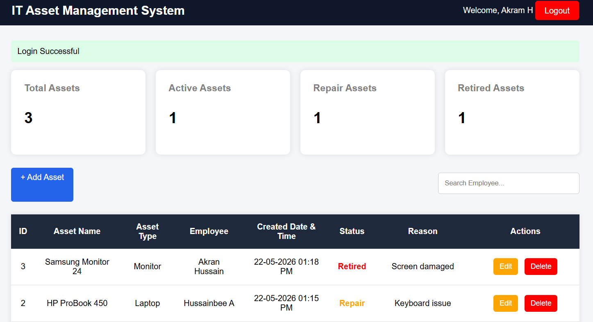

##  IT Asset Pipeline System

## Project Overview

The IT Asset Pipeline System is a web-based application designed to efficiently manage IT assets within an organization. It helps track asset allocation, maintain records, manage users, and streamline IT asset workflows.

## This system includes modules for:

User authentication (Login/Register)

Asset management

Asset records tracking

Admin control panel

Secure and structured asset pipeline workflow

## Features
 
 User Login & Registration System
 
 Asset Management Dashboard
 
 Asset Records Table
 
 Admin Panel
 
 Organized asset tracking system
 
 Screenshot documentation included

## Project Structure

## Project Structure

- IT_Asset_Pipeline_System
  - app.py
  - config.py
  - requirements.txt
  - README.md
  - static
    - css
    - js
    - images
  - templates
    - login.html
    - register.html
    - admin_dashboard.html
    - tester_dashboard.html
    - developer_dashboard.html
    - user_dashboard.html
  - screenshots
    - login_page.png
    - register_page.png
    - admin_page.png
    - tester_page.png
    - developer_page.png
    - user_interface.png
  - database
    - asset_management.sql

## Screenshots

# Login Page

# Register Page

# Asset Management Table

# Asset Record Table

## Installation & Setup
Bash
# Clone the repository
git clone https://github.com/chussainbee2026-commits/IT_Asset_Pipeline_System.git

# Move into project directory
cd IT_Asset_Pipeline_System

# Create virtual environment (optional but recommended)
python -m venv venv

# Activate virtual environment
# Windows:
venv\Scripts\activate

# Install dependencies
pip install -r requirements.txt

# Run the application

python app.py
 
## Tech Stack

Python

Flask / Django 

HTML, CSS, JavaScript

SQLite / MySQL 

## Author

Hussain bee & Akram Hussain

Aspiring Software Developer passionate about:

Python Development | Web Technologies | AI Development | Artificial Intelligence

## Support

If you found this project useful, consider giving it a * star on GitHub